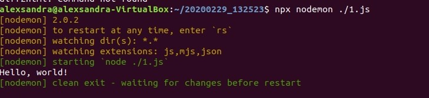
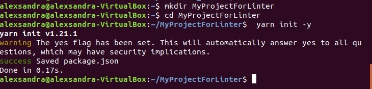
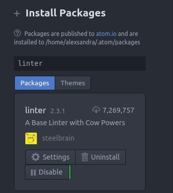
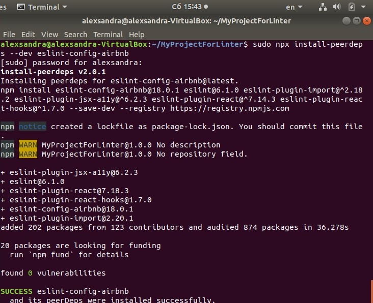
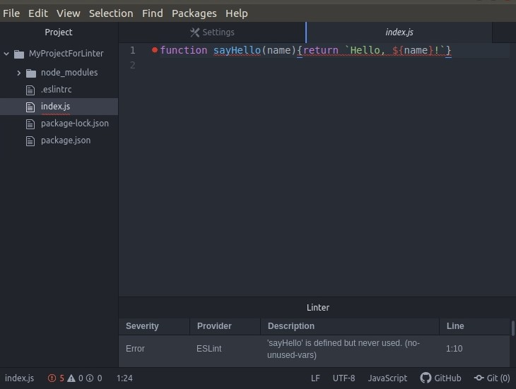
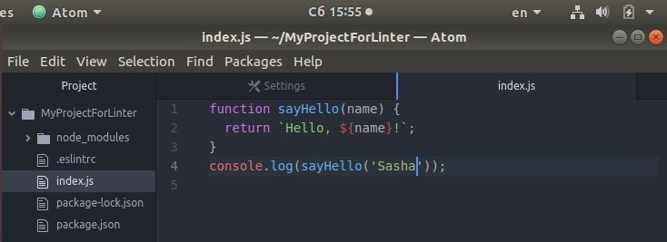
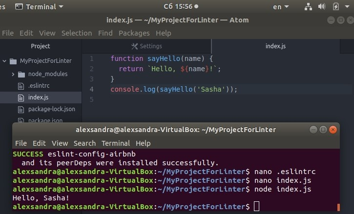

## Лабортаорные работы по веб-проектированию.

1. Установка Node

2. Задачи из учебника
   * Упражнение 1-1
   
  

### Тема 1. Языковые средства веб-технологий на основе XML и CSS и развёртывание среды разработки компонентов аппаратно-программных комплексов.

   1. Разработка предметного языка разметки на основе XML (https://kodaktor.ru/g/web_intro и https://kodaktor.ru/g/xml_intro)  
  
### Тема 2. Основы современного JavaScript (ECMAScript 2016, ECMAScript 2017): синтаксис, структуры данных и функциональный стиль программирования
   1. Развёртывание и настройка папки проекта и приложений для управления JavaScriptпроектом и мониторинга зависимостей
   
   
   
   
   
   
   
   2. Часть А. Разработка веб-сценария, содержащего решение линейной системы уравнений методом Крамера:
   
      [Решение](https://kodaktor.ru/task_20d17)
      
      Часть B. Разработка веб-сценария в функциональном стиле JavaScript с использованием условного (тернарного) оператора:
      
      [Решение](https://kodaktor.ru/ternary_30c2c)
      
#### Тема 3. Тема 3. Элементы асинхронного и событийно-ориентированного клиентского веб-программирования.
 
   1. 
   
   2. Разработка веб-сценария, формирующего галерею кэшированных изображений, с помощью модификации дерева DOM
    
#### Тема 4. Экспериментальная проверка корректности функционирования (тестирование) веб-приложений.

   1.  Установка и настройка линтера кода на языке JavaScript
   
   
   
   
   
   
    
### Самостоятельные работы

      

## Компьютерный практикум.

### Лабораторные работы.

#### Тема 1. Структура экосистемы веб-языков и технологий.

- Развёртывание проекта на JavaScript, включающего модули
   1. Создайте новый проект:
   
   
   
   2. Добавьте зависимости babel-cli и babel-preset-env в раздел девелоперских зависимостей
   
   
   
   3. Создайте простейшую настройку babel в файле .babelrc
   
   
   
   4. Добавьте к проекту библиотеку moment для работы с датами/временем.
   
   
   
   5. Разместите файлы, находящиеся в отношении нативной модульности, в папке./src
   
   
   
   6. Выполните команду транспиляции:
   
   
   
   7. Убедитесь, что получена папка lib с транспилированными файлами, в которых вместо  import и export будут require и module.exports и что вызов файла main.js с помощью node не вызывает ошибок:
   
   
   
- Преобразование кода на JavaScript,  содержащего конструкции из следующих версий стандарта ECMAScript.

   1. Добавьте поддержку class properties.
   
   
   
   2. Изменитефайл .babelrc
   
   
   
   3. Создайте вариант экспортируемого класса без конструктора: namer2.js
   
   
   
   4. Осуществите его импорт в файле index.js
   
   
   
   5. Таблицы файлов package.json и .eslintrc
   
   
   
   6. Получение оттранспилированных файлов
   
   
   
   7. Убедитесь, что всё выполняется без ошибок:
   
   
   
  
