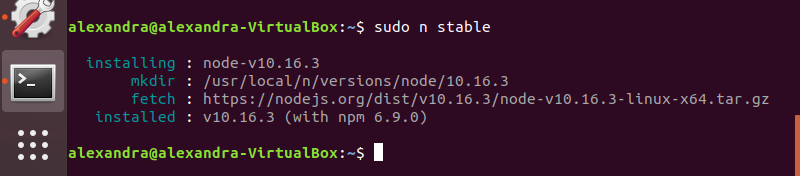
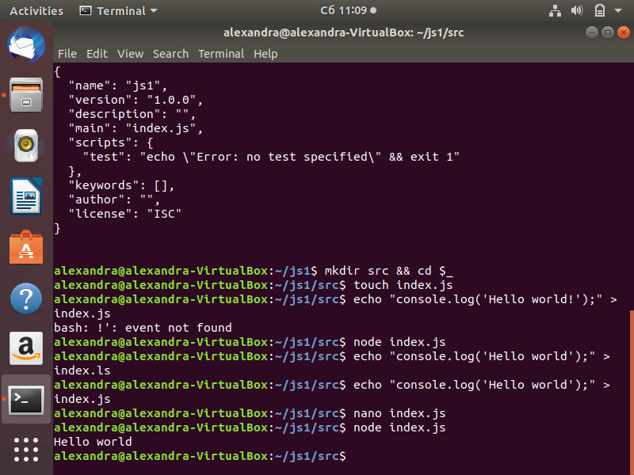
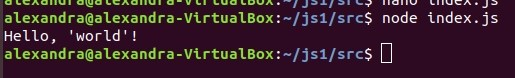

## Лабортаорные работы модуль "Проектирование и разработка веб-решений ". Веб-проектирование и веб-языки

1. Установка Node

2. Задачи из учебника
   * Упражнение 1-1
   
  

### Тема 1. Языковые средства веб-технологий на основе XML и CSS и развёртывание среды разработки компонентов аппаратно-программных комплексов.

   1. Разработка предметного языка разметки на основе XML (https://kodaktor.ru/g/web_intro и https://kodaktor.ru/g/xml_intro)  
   
      [Решение](https://github.com/AlexTrubkina/web-portfolio/tree/master/xml_intro)
  
### Тема 2. Основы современного JavaScript (ECMAScript 2016, ECMAScript 2017): синтаксис, структуры данных и функциональный стиль программирования
   1. Развёртывание и настройка папки проекта и приложений для управления JavaScriptпроектом и мониторинга зависимостей
   
      [Решение](https://github.com/AlexTrubkina/web-portfolio/blob/master/lab21.md)
   
   2. Часть А. Разработка веб-сценария, содержащего решение линейной системы уравнений методом Крамера:
   
      [Решение](https://kodaktor.ru/task_20d17)
      
      Часть B. Разработка веб-сценария в функциональном стиле JavaScript с использованием условного (тернарного) оператора:
      
      [Решение](https://kodaktor.ru/ternary_30c2c)
      
### Тема 3. Элементы асинхронного и событийно-ориентированного клиентского веб-программирования.
 
   1.  [Рещение](https://kodaktor.ru/19112019_8fbdb)
   
   2. Разработка веб-сценария, формирующего галерею кэшированных изображений, с помощью модификации дерева DOM
    
### Тема 4. Экспериментальная проверка корректности функционирования (тестирование) веб-приложений.

   1.  Установка и настройка линтера кода на языке JavaScript
   
       [Решение](https://github.com/AlexTrubkina/web-portfolio/blob/master/lab41.md)
    
## Самостоятельные работы

### ИСР

  1. Проектирование предметного языка формализованного описания или разметки и размещение отчёта по выполнению заданий в веб-портфолио.
  
  2.1 Настройка программного обеспечения для управления зависимостями в вебпроекте
  
   [Решение](https://github.com/AlexTrubkina/web-portfolio/blob/master/lab21.md)
  
  2.2 Проектирование линейного и ветвящегося алгоритма на JavaScript, проектирование рекурсивного алгоритма и фабрики функций на основе каррирования и замыкания и размещение отчёта по выполнению заданий в вебпортфолио
  
   [Решение](https://repl.it/@AlieksandraTrub/Linieinyi-i-vietviashchiisia-alghoritmy#script.js)
  
  3.1 Разработка приложения для асинхронного считывания данных из JSON и вывода в веб-документ путём нативной модификации дерева DOM
  
   [Решение](https://repl.it/@AlieksandraTrub/schityvaniia-dannykh-iz-JSON#index.html)
   
  3.2 Проектирование регулярного выражения и сценария валидации веб-формы и размещение отчёта по выполнению заданий в веб-портфолио.
  
  4.1 Настройка линтера и иных средств мониторинга корректности программного года
  
   [Решение](https://github.com/AlexTrubkina/web-portfolio/blob/master/lab41.md)
   
  4.2 Подготовка наборов модульных тестов и размещение отчёта по выполнению заданий в веб-портфолио
  
  

### ВСР

  1. Проектирование стилей оформления веб-документа с помощью препроцессора
  
  2. Проектирование клиентского сценария обслуживания корзины покупателя в Интернет-магазине
  
   [Решение](https://repl.it/@AlieksandraTrub/DragnDrop)

  3. Подготовка материалов для выступления по функциональному программированию на языке JavaScript
  
   [Решение](https://docs.google.com/presentation/d/1lzrJkNM0bAl7B8Kiz2l1ba0BmboFcQ1VIMCJPjfg6gQ/edit?usp=sharing)

  4. Подготовка презентации по инструментам веб-разработчика в составе браузера
  
   [Решение](https://docs.google.com/presentation/d/1Ix4HaGet8w0OlbyFj2ppwL8IUsnroMkR4hADEJRwkdo/edit?usp=sharing)

## Лабораторные работы. Модуль "Проектирование и разработка веб-решений ".Разработка интерфейсов обогащенных веб-приложений

### Тема 1.  Интерфейсы HTML5 API и их взаимодействие с языком JavaScript

1. Проектирование и разработка интерфейса микшера цветов - инструмента для подбора
цветовых сочетаний для веб-страницы

   [Решение](https://repl.it/@AlieksandraTrub/Color-Mixer#index.html)

2. Проектирование и разработка интерфейса корзины покупателя в интернет-магазине

    [Решение](https://repl.it/@AlieksandraTrub/DragnDrop)
    
### Тема 2. Использование интерфейса Canvas для создания графических вебинтерфейсов

1. Разработка логотипа для веб-портфолио с помощью интерфейса Canvas

   [Решение](https://repl.it/@AlieksandraTrub/Loghotip#script.js)

### Тема 3. Использование интерфейса Canvas или графической библиотеки GD2 языка PHP для визуализации инфографики

1. Создать столбчатую диаграмму для визуализации https://kodaktor.ru/j/rates

### Тема 4. Разработка реактивных веб-интерфейсов на основе языка JSX и Reactкомпонентов.

1. Развёртывание простого приложения на основе React с компонентным интерфейсом в браузере с использованием транспилятора babel, получающего данные из JSON-ресурса

2.  Создание интерфейса MaterialUI на React-платформе

     [Решение](https://stackblitz.com/edit/react-vyzdrc?file=index.js)
     
 ## Самостоятельные работы 
 
 ### ИСР
 
   1.1  Создание интерфейса проекта «Микшер цветов веб-страницы»
   
   [Решение](https://repl.it/@AlieksandraTrub/Color-Mixer#index.html)
   
   1.2 Разработка проекта «Интерфейс корзины покупателя»
    
   [Решение](https://repl.it/@AlieksandraTrub/DragnDrop)
   
   1.3  Разработка приложения с реализацией перетаскивания и анимации.
   
   [Решение](https://repl.it/@AlieksandraTrub/DragnDrop)
   
   2.1 Разработка приложения на основе интерфейса Canvas
   
   [Решение](https://repl.it/@AlieksandraTrub/Loghotip#script.js)
   
   2.2 Разработка приложения с использованием фреймворка Fabric.
   
   [Решение](https://repl.it/@AlieksandraTrub/Fabric-example#script.js)
   
   2.3 Разработка приложения на основе интерфейса fetch и интерфейса потоков.
   
   3.1  Разработка приложения для визуализации инфографики 
   
   [Решение](https://repl.it/@AlieksandraTrub/Infoghrafika)
   
   3.2 Разработка приложения для реализации CAPTCHA 
   
   [Решение](https://repl.it/@AlieksandraTrub/Captcha#index.html)
   
   3.3 Разработка приложения с подключением к базе данных с помощью объектноориентированного интерфейса.
   
   4.1 Разработка интерфейса приложения с использованием реактивных компонентов на языке JSX, а также мультимедийных компонентов.
   
   4.2 Разработка приложения на основе интерфейса MaterialUI
   
   [Решение](https://stackblitz.com/edit/react-vyzdrc?file=index.js)
   
   4.3 Сборка проекта с помощью бандлера и с использованием транспилятора. 
   
   
   4.4 Развёртывание приложения на деплой-платформе.
   
   [Решение](https://github.com/AlexTrubkina/web-portfolio/blob/master/Comp%20Pract/vsr4/report.md)
   
 
 ### ВСР
 
   1.  Подготовка сообщения и мастер-класса по интерфейсу Web Audio
   
   [Решение](https://docs.google.com/presentation/d/18-urGRt8CFJKt5cHDCc9_vjAeglfhbLwSAJOsQWEDvc/edit?usp=sharing)
   
   2. Подготовка выступления и мастер-класса по сравнению характеристик Canvas и SVG
   
   [Решение](https://docs.google.com/presentation/d/1sqg6dvST-r13IyYRRwd6Z5WcAHHFdltXhDdII5Mz1_E/edit?usp=sharing)
   
   3. Подготовка презентации и мастер-класса по сравнению характеристик GD2 и Canvas   
   
   
   4. Разработка интерфейса веб-ресурса на базе библиотеки React и подготовка сообщения и мастер-класса по этой теме.
   
   [Веб-ресурс](https://stackblitz.com/edit/react-vyzdrc?file=index.js)
   [Сообщение](https://docs.google.com/presentation/d/1a4I3m5m2QsvUjGzkhDy3GSn1PVRLDMuLZslSfyQZSXw/edit?usp=sharing)

# Компьютерный практикум.

## Лабораторные работы.

### Тема 1. Структура экосистемы веб-языков и технологий.

- Развёртывание проекта на JavaScript, включающего модули
   [Решение](https://github.com/AlexTrubkina/web-portfolio/blob/master/comppract11.md)
   
- Преобразование кода на JavaScript,  содержащего конструкции из следующих версий стандарта ECMAScript.

   [Решение](https://github.com/AlexTrubkina/web-portfolio/blob/master/comppract12.md)
   
### Тема 2.  Серверные программные комплексы на платформе JavaScript и PHP 

- Создание простого веб-сервера на основе Node.js

  [Решение](https://github.com/AlexTrubkina/web-portfolio/blob/master/Comp%20Pract/Theme%202.1/report.md)

- Моделирование взаимодействия «клиент-сервер» с помощью программы telnet и программы curl

  [Решение](https://github.com/AlexTrubkina/web-portfolio/blob/master/Comp%20Pract/Theme2.2/report.md)

### Тема 3.  Решение практических задач обращения с данными на серверной стороне

- Создание клиентского веб-приложения для извлечения данных

  [Решение](https://repl.it/@AlieksandraTrub/Lab-rabota-tiema-31#index.html)

- Разработка базы данных (БД) типа «ключ-значение» и обращение к ней

### Тема 4. Развёртывание и управление веб-ресурсом (веб-портфолио) с помощью клиентского и серверного фреймворка

- Создание веб-приложения с помощью node.js с использованием серверного шаблонизатора

  [Решение](https://github.com/AlexTrubkina/web-portfolio/blob/master/Comp%20Pract/Theme41/report.md)

-  Создание веб-приложения с аутентификацией на основе сессий

 ### ИСР
 
  1.1 Транспиляция и сборка проекта с использованием директив импорта и экспорта в код с модульностью CommonJS
  
   [Решение](https://github.com/AlexTrubkina/web-portfolio/blob/master/comppract11.md)
  
  1.2 Транспиляция и сборка проекта с использованием оператора связывания или иных трансформационных плагинов транспилятора
  
   [Решение](https://github.com/AlexTrubkina/web-portfolio/blob/master/comppract12.md)
  
  2.1 Разработка приложения на основе шаблона Node.js HTTP Simple Server, выдающего результаты вычислений в формате JSON
  
   [Решение](https://github.com/AlexTrubkina/web-portfolio/blob/master/Comp%20Pract/Theme%202.1/report.md)
  
  2.2 Эмулирование отправки HTTP-запроса серверу методом GET с помощью клиентов telnet с записью скринкаста совершаемых действий.
  
   [Решение](https://drive.google.com/file/d/10TK9Y3LsUETvX2DWQ7pvb_iFchiLJU4R/view?usp=sharing)
  
  2.3 Отправка HTTP-запроса серверу методом GET и POST с помощью приложения cURL с записью скринкаста совершаемых действий. 
  
   [Решение](https://drive.google.com/file/d/1OpduGbiBqcucNIGyYh07zK5fcK20yaVe/view?usp=sharing)
  
  3.1 Разработка приложения, извлекающего данные из файла в формате JSON
  
  3.2 Проектирование веб-базы данных и разработка приложения на основе фреймворка Express с реализацией маршрутизации и операций CRUD над простой БД с обработкой запросов REST 
  
  4.1 Подключение серверного шаблонизатора к веб-приложению и формирование основной структуры веб-портфолио.    
  
  [Решение](https://github.com/AlexTrubkina/web-portfolio/blob/master/Comp%20Pract/Theme41/report.md)
  
  4.2 Анализ и настройка серверной компоненты веб-сайта. Анализ и настройка механизма аутентификации веб-сайта в том числе на основе механизма сессий.
  
  [Решение](https://github.com/AlexTrubkina/web-portfolio/blob/master/Comp%20Pract/vsr2/report.md)

### ВСР

  1. Сборка проекта с помощью бандлера Webpack
  
   [Решение](https://github.com/AlexTrubkina/web-portfolio/blob/master/Comp%20Pract/vsr1/report.md)
  
  2. Разработка REST-микросервиса с аутентификацией 
  
   [Решение](https://github.com/AlexTrubkina/web-portfolio/tree/master/Comp%20Pract/vsr2)
  
  3. Подготовка презентации по Mongo и Mongoose
  
   [Презентация](https://docs.google.com/presentation/d/1IdNbPVwmUBoV8AZNGIg1cUt72gw8H5-IrDs8sW-NfXw/edit?usp=sharing)
  
  4. Развёртывание веб-ресурса на платформе Heroku
  
   [Решение](https://github.com/AlexTrubkina/web-portfolio/blob/master/Comp%20Pract/vsr4/report.md)

  
