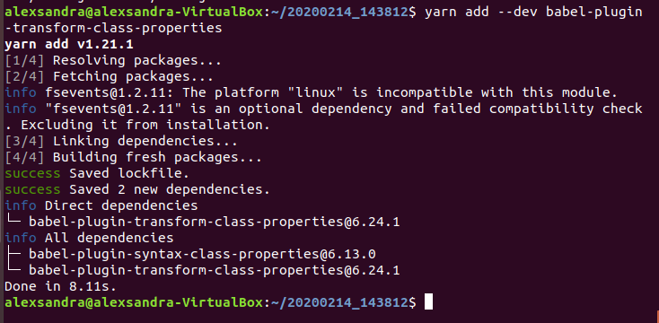
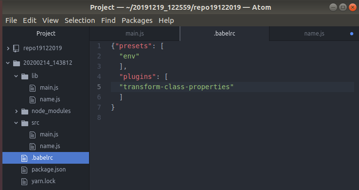
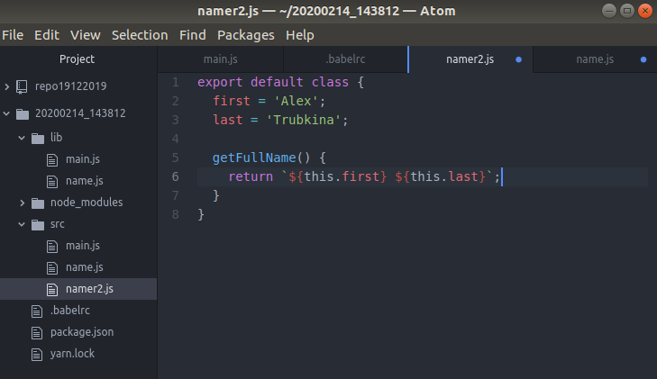
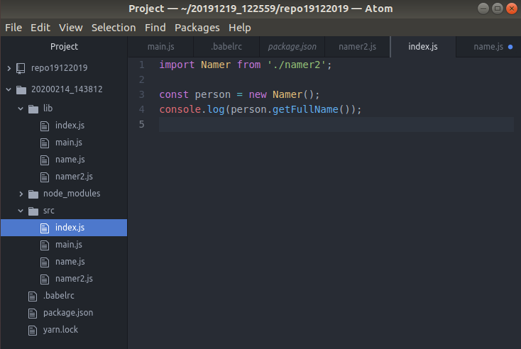
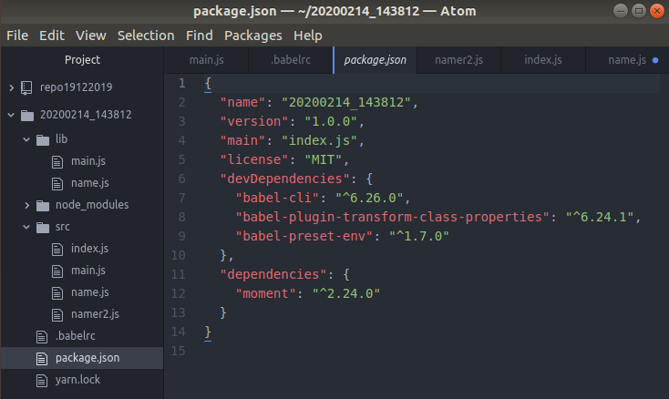
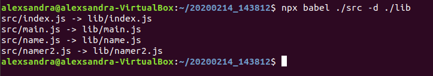
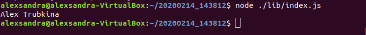

## Лабортаорные работы по веб-проектированию.

1. Установка Node

2. Задачи из учебника
   * Упражнение 1-1
   
  
  
### Домашняя работа
[https://kodaktor.ru/29102019_c8f2f](https://kodaktor.ru/29102019_c8f2f)
### Лабораторные работы
[https://kodaktor.ru/07112019_9da15](https://kodaktor.ru/07112019_9da15)

[https://kodaktor.ru/07112019_eafdc](https://kodaktor.ru/07112019_eafdc)

## Компьютерный практикум.

### Лабораторные работы.

#### Тема 1. Структура экосистемы веб-языков и технологий.

- Развёртывание проекта на JavaScript, включающего модули
   1. Создайте новый проект:
   
   
   
   2. Добавьте зависимости babel-cli и babel-preset-env в раздел девелоперских зависимостей
   
   
   
   3. Создайте простейшую настройку babel в файле .babelrc
   
   
   
   4. Добавьте к проекту библиотеку moment для работы с датами/временем.
   
   
   
   5. Разместите файлы, находящиеся в отношении нативной модульности, в папке./src
   
   
   
   6. Выполните команду транспиляции:
   
   
   
   7. Убедитесь, что получена папка lib с транспилированными файлами, в которых вместо  import и export будут require и module.exports и что вызов файла main.js с помощью node не вызывает ошибок:
   
   
   
- Преобразование кода на JavaScript,  содержащего конструкции из следующих версий стандарта ECMAScript.

   1. Добавьте поддержку class properties.
   
   
   
   2. Изменитефайл .babelrc
   
   
   
   3. Создайте вариант экспортируемого класса без конструктора: namer2.js
   
   
   
   4. Осуществите его импорт в файле index.js
   
   
   
   5. Таблицы файлов package.json и .eslintrc
   
   
   
   6. Получение оттранспилированных файлов
   
   
   
   7. Убедитесь, что всё выполняется без ошибок:
   
   
   
  #### Тема 2. Серверные программные комплексы на платформе JavaScript и PHP
 
 -  Созданиепростоговеб-серверанаосновеNode.js
   
   1. Создайтеновыйпроект:
   2. Установите инструмент nodemon для автоматизации перезапуска сценария и moment для работы с датой и временем:
   3. Установите настройки линтера и создайте нужный файл .eslintrc
   4. Создайте в папке проекта файл index.js
   5.  Запустите сценарий yarn start и выполните curl localhost:4321
   6. Убедитесь, что в консоли отображается текущая дата и время
   7. Добавьте к проекту поддержку выдачи данных в формате JSON с выдачей соответствующего заголовка и кодировки UTF-8:http://kodaktor.ru/git-checkout.gif
   8. Перейдите по адресу localhost:4321 в браузере и убедитесь, что выдаётся ответ в формате JSON
   9. Осуществите рефакторинг кода так, чтобы коллбэк, отвечающий на запросы, явным образом указывался для события request:
