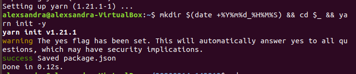
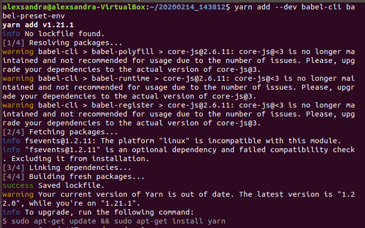
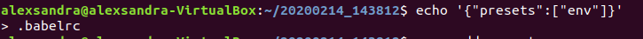
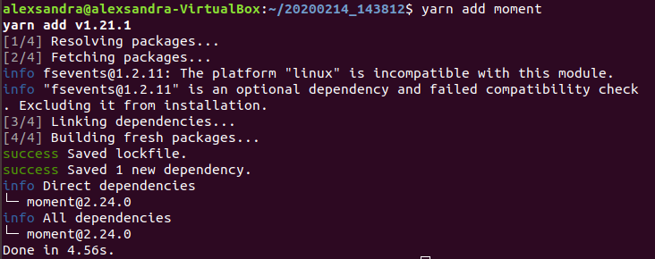
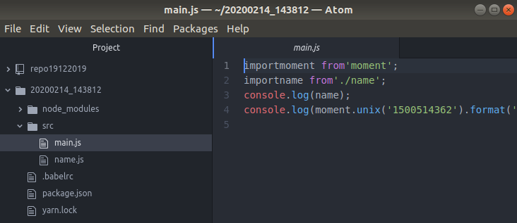
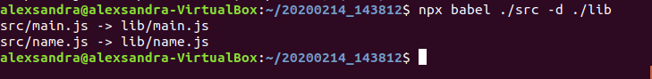
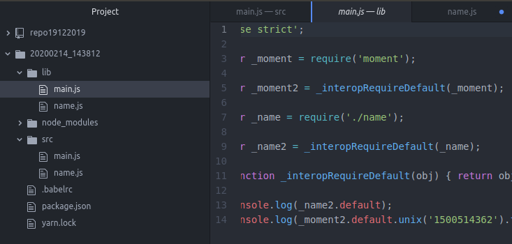

1. Создайте новый проект:
   
   
   
   2. Добавьте зависимости babel-cli и babel-preset-env в раздел девелоперских зависимостей
   
   
   
   3. Создайте простейшую настройку babel в файле .babelrc
   
   
   
   4. Добавьте к проекту библиотеку moment для работы с датами/временем.
   
   
   
   5. Разместите файлы, находящиеся в отношении нативной модульности, в папке./src
   
   
   
   6. Выполните команду транспиляции:
   
   
   
   7. Убедитесь, что получена папка lib с транспилированными файлами, в которых вместо  import и export будут require и module.exports и что вызов файла main.js с помощью node не вызывает ошибок:
   
   
