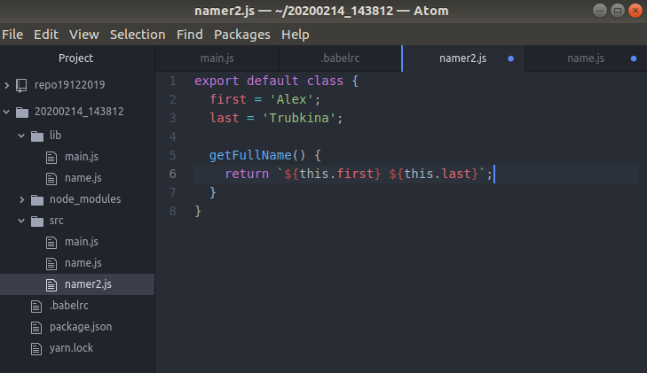
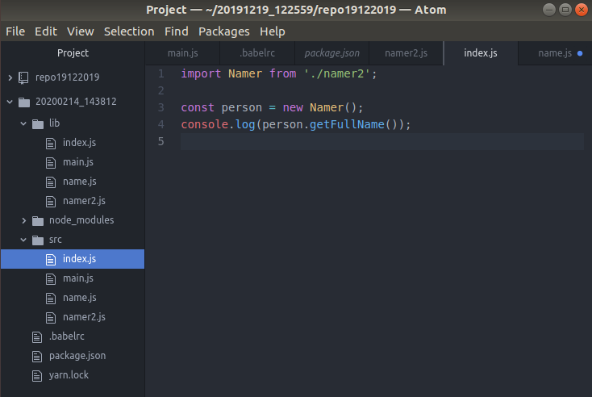
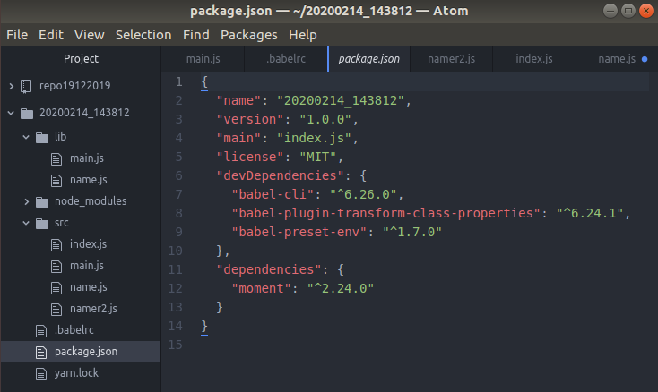
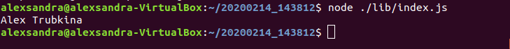

1. Добавьте поддержку class properties.
   
   
   
   2. Изменитефайл .babelrc
   
   
   
   3. Создайте вариант экспортируемого класса без конструктора: namer2.js
   
   
   
   4. Осуществите его импорт в файле index.js
   
   
   
   5. Таблицы файлов package.json и .eslintrc
   
   
   
   6. Получение оттранспилированных файлов
   
   
   
   7. Убедитесь, что всё выполняется без ошибок:
   
   
   
